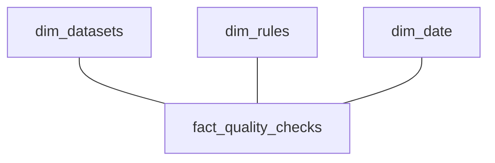

# DataPulse Analytics - Data Dictionary

## Overview

This document describes the analytics star schema used by the DataPulse quality monitoring system. The schema follows dimensional modeling best practices for analytical workloads.

## Schema Diagram



## Dimension Tables

### dim_datasets

Describes uploaded datasets that undergo quality validation.

| Column | Type | Description |
|--------|------|-------------|
| id | INTEGER | Primary key (natural key from app DB) |
| name | VARCHAR(255) | Original filename |
| file_type | VARCHAR(10) | File format: csv, json, xlsx |
| row_count | INTEGER | Number of rows in dataset |
| column_count | INTEGER | Number of columns |
| status | VARCHAR(20) | Processing status: PENDING, VALIDATED, FAILED |
| uploaded_at | TIMESTAMP | Upload timestamp |

**Grain**: One row per dataset upload

**SCD Type**: Type 1 (overwrite on change)

### dim_rules

Describes validation rules applied to datasets.

| Column | Type | Description |
|--------|------|-------------|
| id | INTEGER | Primary key (natural key from app DB) |
| name | VARCHAR(255) | Human-readable rule name |
| field_name | VARCHAR(255) | Target column for validation |
| rule_type | VARCHAR(20) | Rule category: NOT_NULL, RANGE, REGEX, UNIQUE, DATA_TYPE |
| severity | VARCHAR(10) | Impact level: HIGH, MEDIUM, LOW |
| dataset_type | VARCHAR(100) | Applicable dataset category |
| is_active | BOOLEAN | Rule enabled flag |

**Grain**: One row per validation rule definition

**SCD Type**: Type 1 (overwrite on change)

### dim_date

Calendar dimension for time-based analysis.

| Column | Type | Description |
|--------|------|-------------|
| date_key | INTEGER | Primary key (YYYYMMDD format) |
| full_date | DATE | Calendar date |
| day_of_week | INTEGER | 0=Monday through 6=Sunday |
| month | INTEGER | Month number (1-12) |
| quarter | INTEGER | Quarter number (1-4) |
| year | INTEGER | Four-digit year |

**Grain**: One row per calendar date

**SCD Type**: Type 0 (immutable)

## Fact Tables

### fact_quality_checks

Records individual quality check results.

| Column | Type | Description |
|--------|------|-------------|
| id | SERIAL | Surrogate primary key |
| dataset_id | INTEGER | FK to dim_datasets |
| rule_id | INTEGER | FK to dim_rules |
| date_key | INTEGER | FK to dim_date |
| passed | BOOLEAN | Check passed flag |
| failed_rows | INTEGER | Count of rows failing validation |
| total_rows | INTEGER | Total rows validated |
| score | FLOAT | Quality score: (total - failed) / total * 100 |
| checked_at | TIMESTAMP | Execution timestamp |

**Grain**: One row per check execution

**Load Strategy**: Append-only (immutable events)

## Aggregation Tables

### agg_daily_quality

Pre-aggregated daily quality metrics for dashboard performance.

| Column | Type | Description |
|--------|------|-------------|
| date_key | INTEGER | Date key (composite PK) |
| dataset_id | INTEGER | Dataset ID (composite PK) |
| total_checks | INTEGER | Daily check count |
| passed_checks | INTEGER | Passed check count |
| failed_checks | INTEGER | Failed check count |
| avg_score | FLOAT | Daily average score |
| min_score | FLOAT | Minimum score observed |
| max_score | FLOAT | Maximum score observed |
| high_severity_failures | INTEGER | HIGH severity failure count |
| medium_severity_failures | INTEGER | MEDIUM severity failure count |
| low_severity_failures | INTEGER | LOW severity failure count |
| updated_at | TIMESTAMP | Last refresh timestamp |

**Grain**: One row per dataset per day

**Load Strategy**: Upsert (refreshed daily)

## ETL Tracking Tables

### etl_run_log

Pipeline execution audit trail.

| Column | Type | Description |
|--------|------|-------------|
| id | SERIAL | Primary key |
| run_id | VARCHAR(50) | Unique run identifier |
| started_at | TIMESTAMP | Pipeline start time |
| completed_at | TIMESTAMP | Pipeline end time |
| status | VARCHAR(20) | SUCCESS, FAILED, RUNNING |
| mode | VARCHAR(20) | FULL, INCREMENTAL |
| records_extracted | INTEGER | Source record count |
| records_loaded | INTEGER | Target record count |
| duration_seconds | FLOAT | Execution duration |
| error_message | TEXT | Error details if failed |

## Indexes

| Table | Index | Columns | Purpose |
|-------|-------|---------|---------|
| dim_rules | idx_rules_type | rule_type | Filter by rule type |
| dim_rules | idx_rules_severity | severity | Filter by severity |
| dim_date | idx_date_year_month | year, month | Time-series filtering |
| fact_quality_checks | idx_facts_dataset_date | dataset_id, date_key | Time-series by dataset |
| fact_quality_checks | idx_facts_rule | rule_id | Rule analysis |
| fact_quality_checks | idx_facts_date | date_key | Date filtering |
| fact_quality_checks | idx_facts_passed | passed (WHERE FALSE) | Failed checks lookup |
| fact_quality_checks | idx_facts_score_range | score (WHERE < 70) | Critical score lookup |

## Data Lineage

```
Source Tables (App DB)          Analytics Tables (Star Schema)
---------------------           -----------------------------
check_results     ----+
                      |------>  fact_quality_checks
validation_rules  ----+------>  dim_rules
                      |
datasets          ----+------>  dim_datasets
                      |
                      +------>  dim_date (generated)
```

## Quality Rules

| Rule | Severity | Description |
|------|----------|-------------|
| NOT_NULL | HIGH | Field must not contain null values |
| UNIQUE | HIGH | Field values must be unique |
| RANGE | HIGH/MEDIUM | Numeric values within specified bounds |
| REGEX | MEDIUM | Values match regex pattern |
| DATA_TYPE | MEDIUM/LOW | Values conform to expected type |

## Score Calculation

Quality score is computed as:

```
score = (total_rows - failed_rows) / total_rows * 100
```

Score thresholds:
- **Healthy**: >= 90%
- **Warning**: 70% - 89%
- **Critical**: < 70%
