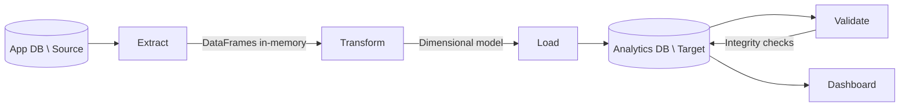

# DataPulse ETL Pipeline Architecture

## Overview

The DataPulse ETL pipeline extracts quality check results from the application database, transforms them into a star schema, and loads them into an analytics database for reporting and dashboarding.

## Pipeline Flow



## Execution Modes

### Full Load
- Extracts all records from source
- Upserts all dimensions
- Appends all facts
- Use for: Initial load, data recovery

### Incremental Load
- Extracts records since last successful run
- Upserts changed dimensions
- Appends new facts only
- Use for: Daily/hourly scheduled runs

### Dry Run
- Extracts and transforms data
- Skips load and validation
- Use for: Testing, data preview

## Component Details

### Extract (pipeline/etl/extract.py)

Reads from the application database with a single JOIN query that denormalizes check results with rule and dataset metadata.

Key features:
- Batched extraction support via generator
- Configurable batch size (default: 1000)
- Incremental extraction based on checked_at timestamp

### Transform (pipeline/etl/transform.py)

Converts raw extract into dimensional model:

1. **Dimension building**: Deduplicates and renames columns
2. **Date dimension**: Generates calendar rows for date range
3. **Fact building**: Computes score, adds date_key foreign key

Validation checks:
- Required columns present
- No nulls in critical fields
- Positive row counts

### Load (pipeline/etl/load.py)

Writes to target database with conflict handling:

- **Dimensions**: Upsert (INSERT ON CONFLICT UPDATE)
- **Facts**: Append (INSERT only)
- **Batching**: Configurable batch size for memory efficiency

Database compatibility:
- PostgreSQL: Uses ON CONFLICT clause
- SQLite: Uses INSERT OR REPLACE (for testing)

### Validate (pipeline/etl/validate.py)

Post-load integrity checks:

1. **Row counts**: Source vs target comparison
2. **FK integrity**: No orphaned dimension references
3. **Score bounds**: Values within 0-100 range

Returns warnings list for operational alerting.

## Configuration

All settings in `config/config.yaml`:

```yaml
database:
  source_url: ${DATABASE_URL}
  target_url: ${TARGET_DB_URL}

etl:
  batch_size: 1000
  parallel_workers: 4
  retry_attempts: 3

logging:
  level: INFO
  directory: logs
```

## Dashboard

File: `dashboards/quality_dashboard.py`

A Streamlit application that connects directly to the analytics database and visualizes data quality metrics.

### Features
- **Quality score trends**: Line charts of `avg_score` over time per dataset, sourced from `agg_daily_quality`
- **Dataset comparison**: Bar charts comparing quality scores across datasets
- **Severity breakdown**: Stacked charts showing HIGH/MEDIUM/LOW failure counts
- **Current health summary**: Latest scores and pass/fail ratios per dataset

### Data Sources
| View/Table | Used for |
|------------|----------|
| `agg_daily_quality` | Trend charts and historical comparisons (fast, pre-aggregated) |
| `fact_quality_checks` | Drill-down into individual check results |
| `dim_datasets` | Dataset names and metadata |
| `dim_date` | Time axis for trend charts |

### Running the Dashboard
```bash
streamlit run dashboards/quality_dashboard.py
```

## Development & Seeding

File: `seed/seed_analytics.py`

Seeds the source (app) database with realistic mock data to unblock dashboard and pipeline development without requiring live backend data.

- Idempotent — safe to run multiple times without duplicating records
- Generates datasets, validation rules, and check results with realistic score distributions

```bash
python -m seed.seed_analytics
```

Use this when developing locally before real data is available.


## Error Handling

| Error Type | Handling | Recovery |
|------------|----------|----------|
| Connection failure | Retry 3x with backoff | Alert ops |
| Query timeout | Reduce batch size | Retry |
| Validation failure | Skip record, log warning | Manual review |
| FK constraint | Skip load, rollback batch | Fix source data |

## Monitoring

Key metrics to track:
- Pipeline duration
- Records extracted/loaded
- Validation warnings
- Error rate

Log files:
- `logs/etl.log`: All messages
- `logs/etl_errors.log`: Warnings and errors only

Database audit trail:
- `etl_run_log` table (added by V003): Each pipeline run writes a row with status, record counts, duration, and error details. Use this for operational monitoring and incremental load watermarking.

## Data Dependencies

Upstream:
- `check_results` table (input)
- `validation_rules` table (input)
- `datasets` table (input)

Downstream:
- Quality dashboard (consumer)
